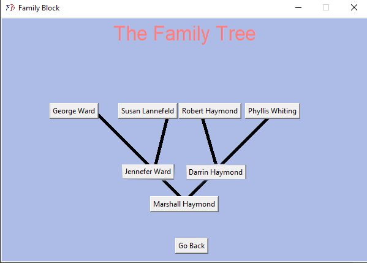
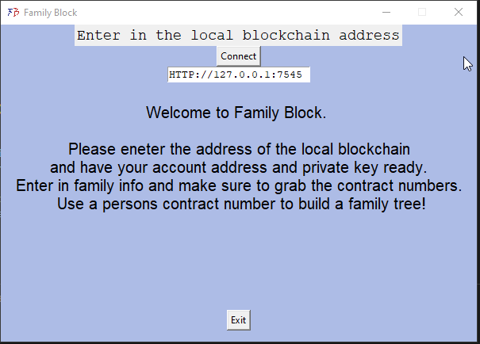
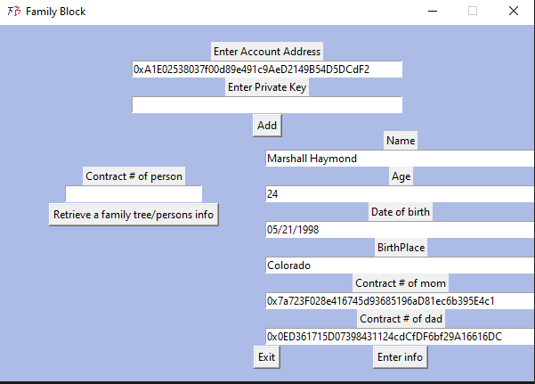

# FamilyBlock

## Description

FamilyBlock, a blockchain solution that lets users store a family tree by utilizing a smart contract

## Getting Started

* Download [Ganache](https://trufflesuite.com/ganache/)
* clone repo

### Dependencies

* Python 3.0+

### Installing/Setup

* Spin up Ganache
* Run maininterface.py
* Enter in local blockchain

* Add the info into the next interface. Start with oldest person in your family tree and work down to yourself
* Look into Ganache for the final contract number after you have entered in your family info to build your family tree 

## Authors

Contributors names and contact info

Marshall Haymond  

## Version History

* 0.1
    * Initial Release

## Future Ideas
* Connect to blockchain on the internet
* Export contract number

## License

This project is licensed under the Marshall Haymond License

## Acknowledgments

Inspiration, code snippets, etc.
* https://blockchain101.com/
* https://github.com/clearmatics/ganache-cli
